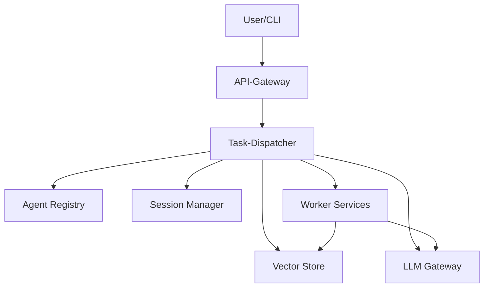

# Agent-NN MCP

Agent-NN ist ein Multi-Agent-System, das im Rahmen der Modular Control Plane in mehrere Microservices aufgeteilt wurde. Jeder Service erfüllt eine klar definierte Aufgabe und kommuniziert über REST-Schnittstellen.

## Systemvoraussetzungen

- Python 3.9 oder neuer
- Mindestens 4 GB RAM

## Komponentenübersicht



- **Task-Dispatcher** – Koordiniert eingehende Aufgaben.
- **Agent Registry** – Hält verfügbare Worker-Services vor.
- **Session Manager** – Speichert Kontexte in Redis.
- **Vector Store** – Bietet Dokumentensuche für RAG.
- **LLM Gateway** – Einheitliche Schnittstelle zu Sprachmodellen.
- **Worker Services** – Domänenspezifische Agenten.

## Schnellstart

1. Repository klonen
   ```bash
   git clone https://github.com/EcoSphereNetwork/Agent-NN.git
   cd Agent-NN

   ```
2. Abhängigkeiten installieren
   ```bash
   pip install -r requirements.txt
   ```
3. Basis-Services starten
   ```bash
   docker-compose up dispatcher registry session-manager
   ```
4. Testanfrage stellen
```bash
curl -X POST http://localhost:8000/task -H "Content-Type: application/json" -d '{"task_type": "chat", "input": "Hallo"}'
```

## CLI

Das Kommando `agentnn` wird nach der Installation verfügbar. Die Version kann mit

```bash
agentnn --version
```
abgerufen werden.

Weitere Details findest du im Ordner [docs/](docs/).

## 🤖 Installation (Entwicklung)

```bash
git clone https://github.com/EcoSphereNetwork/Agent-NN.git
cd Agent-NN
pip install -e .[sdk]
agentnn --version
```

### Empfohlene Umgebung

- Python 3.9 oder neuer
- Mindestens 4 GB RAM (8 GB empfohlen)
