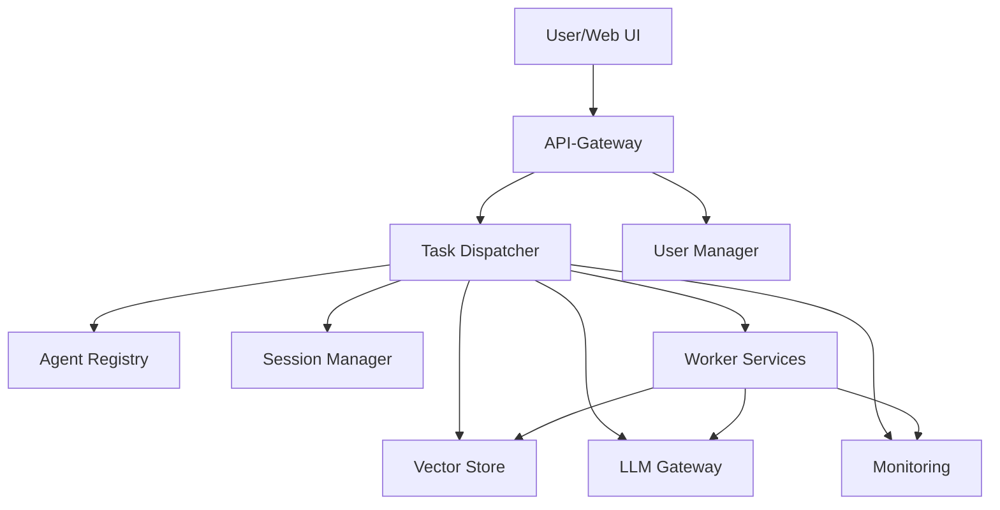

# Agent-NN 


Agent-NN ist ein Multi-Agent-System mit integrierten neuronalen Netzen. Jeder Service erfüllt eine klar definierte Aufgabe und kommuniziert über REST-Schnittstellen. Neben den Backend-Diensten stellt das Projekt ein Python‑SDK, eine CLI und ein React-basiertes Frontend bereit. Weitere Dokumentation befindet sich im Ordner [docs/](docs/).
Aktuelle Version: **v1.0.3** – Flowise-Export und Dokumentation aktualisiert.

## Systemvoraussetzungen

- Python 3.9 oder neuer
- Mindestens 4 GB RAM

## Komponentenübersicht



- **Task-Dispatcher** – Koordiniert eingehende Aufgaben.
- **Agent Registry** – Hält verfügbare Worker-Services vor.
- **Session Manager** – Speichert Kontexte in Redis.
- **Vector Store** – Bietet Dokumentensuche für RAG.
- **LLM Gateway** – Einheitliche Schnittstelle zu Sprachmodellen.
- **User Manager** – Verwaltet Nutzerkonten und Tokens.
- **Monitoring** – Prometheus sammelt Metriken aller Dienste.
- **Worker Services** – Domänenspezifische Agenten.

## Schnellstart

1. Repository klonen
   ```bash
   git clone https://github.com/EcoSphereNetwork/Agent-NN.git
   cd Agent-NN
   ```
2. Abhängigkeiten mit Poetry installieren und Beispielkonfiguration kopieren
   ```bash
   poetry install
   cp .env.example .env
   ```
3. (Optional) Lokale Modelle herunterladen
   ```bash
   python scripts/setup_local_models.py --model all
   ```
4. Frontend bauen
   ```bash
   ./scripts/deploy/build_frontend.sh
   ```
5. Dienste starten
   ```bash
   ./scripts/deploy/start_services.sh
   ```
6. Erste Anfrage stellen oder UI öffnen
   ```bash
   curl -X POST http://localhost:8000/task -H "Content-Type: application/json" \
     -d '{"task_type": "chat", "input": "Hallo"}'
   # UI: http://localhost:3000
   ```

Alternativ lassen sich alle Dienste per Docker Compose starten:
```bash
docker compose up --build
```

## Hilfreiche Skripte

| Script | Zweck |
|---|---|
| `scripts/deploy/build_frontend.sh` | Baut die React-Oberfläche in `frontend/dist/` |
| `scripts/deploy/start_services.sh` | Startet alle Container nach einem Port- und .env-Check |
| `scripts/deploy/dev_reset.sh` | Entfernt Volumes und lokale Daten für einen Neustart |
| `scripts/setup_local_models.py` | Lädt optionale Llamafile-Modelle herunter |
| `scripts/build_and_test.sh` | Erstellt ein Docker-Image und führt Tests aus |
| `scripts/deploy_to_registry.sh` | Publiziert Images in ein Container-Registry |
| `scripts/start_mcp.sh` | Startet das Microservice-Compose-Setup |

## Poetry-Workflow

Das Projekt nutzt [Poetry](https://python-poetry.org/) zur Verwaltung der Python-Abhängigkeiten.
Nach dem Klonen installierst du alle Pakete und aktivierst die virtuelle Umgebung mit:

```bash
poetry install
poetry shell
```

Alternativ kannst du Befehle auch direkt über `poetry run <command>` ausführen.

## Konfiguration

Eine Beispielkonfiguration steht in `.env.example`. Kopiere die Datei bei Bedarf nach `.env` und passe die Werte an. Eine vollständige Liste aller Variablen ist in [docs/config_reference.md](docs/config_reference.md) beschrieben.

Weitere Details zur Einrichtung findest du in [docs/deployment.md](docs/deployment.md).
## CLI

Das Kommando `agentnn` wird nach der Installation verfügbar. Die Version kann mit

```bash
agentnn --version
```
abgerufen werden.

Wichtige Befehle:
```bash
agentnn agents     # verfügbare Agents auflisten
agentnn sessions   # aktive Sessions anzeigen
agentnn feedback   # Feedback-Tools
agentnn config check  # geladene Konfiguration anzeigen
```

Weitere Details findest du im Ordner [docs/](docs/).

### Example `llm_config.yaml`

```yaml
default_provider: openai
providers:
  openai:
    type: openai
    api_key: ${OPENAI_API_KEY}
  anthropic:
    type: anthropic
    api_key: ${ANTHROPIC_API_KEY}
  local:
    type: local
    model_path: ./models/mistral-7b.Q4_K_M.gguf
```

## 🤖 Installation (Entwicklung)

```bash
git clone https://github.com/EcoSphereNetwork/Agent-NN.git
cd Agent-NN
poetry install
poetry run agentnn --version

# Falls der Installationsschritt scheitert, kann `poetry install --no-root`
# verwendet werden. Alternativ lässt sich der Paketmodus in der
# `pyproject.toml` mit `package-mode = false` deaktivieren.
```

### Empfohlene Umgebung

- Python 3.9 oder neuer
- Mindestens 4 GB RAM (8 GB empfohlen)

## Frontend Development

The consolidated React interface lives in `frontend/agent-ui`. All legacy
components have been archived under `archive/ui_legacy`.

```bash
cd frontend/agent-ui
npm install
npm run dev
```

Run `npm run build` to create the static files in `frontend/dist/`.

## Integrations

Agent-NN stellt Plugins für n8n und FlowiseAI bereit. Details finden sich in
[docs/integrations](docs/integrations/index.md). Schnelleinstiege stehen in den Abschnitten [n8n Quick Start](docs/integrations/n8n.md#quick-start) und [Flowise Quick Start](docs/integrations/flowise.md#quick-start).
Die Beispielkomponenten lassen sich mit `npm install && npx tsc` in den jeweiligen Unterordnern kompilieren und anschließend
in n8n bzw. Flowise registrieren. Der PluginManager lädt nur die JavaScript-Dateien,
daher müssen die Komponenten vor einer Veröffentlichung stets gebaut werden. Der vollständige Ablauf ist im
[Full Integration Plan](docs/integrations/full_integration_plan.md) beschrieben.
Sämtliche Integrationen akzeptieren optionale Parameter wie `path`, `method`,
`headers`, `timeout` sowie Auth-Daten, um alternative Endpunkte zu adressieren.


### Quickstart Flowise

```bash
cd integrations/flowise-agentnn
npm install && npx tsc
# In der Flowise-UI die Datei dist/AgentNN.js hochladen
```

Danach kann ein Flow den Agent über das Feld `endpoint` ansprechen. Beispiel-
Flows liegen im gleichen Ordner.

Jeder neu erstellte Agent wird zusätzlich im Flowise-Format abgelegt. Die Datei
`<name>_flowise.json` kann über `GET /agents/<id>?format=flowise` abgerufen und
direkt in Flowise importiert werden.

```bash
curl http://localhost:8000/agents/demo?format=flowise
```

## MCP Server

Der integrierte MCP-Server stellt unter `/v1/mcp/*` eine kompatible Schnittstelle für externe Dienste bereit. Die Python-Klasse `agentnn.mcp.MCPClient` ermöglicht das Senden von Aufgaben und Kontextdaten. Weitere Informationen finden sich in [docs/mcp.md](docs/mcp.md). Wichtige Endpunkte:

- `POST /v1/mcp/execute` – Dispatch von Aufgaben
- `POST /v1/mcp/task/execute` – Alias zu `/execute`
- `POST /v1/mcp/agent/create` – Registrierung neuer Agenten
- `POST /v1/mcp/tool/use` – Aufruf eines Plugin-Tools
- `POST /v1/mcp/context` – Kontext speichern
- `GET /v1/mcp/context/{session_id}` – Kontext abrufen


## Tests & Beiträge

Bevor du einen Pull Request erstellst, führe bitte `ruff`, `mypy` und `pytest` aus. Details zum Entwicklungsprozess findest du in [CONTRIBUTING.md](CONTRIBUTING.md) sowie im Dokument [docs/test_strategy.md](docs/test_strategy.md). Sollten Module fehlen, können lokale Wheels oder ein internes Paketmirror verwendet werden.

## Releases

Der komplette Ablauf für neue Versionen ist im [Release Checklist](docs/release_checklist.md) beschrieben.

## Monitoring & Maintenance

Prometheus scrapes metrics from each service at `/metrics`. A sample configuration
is provided in `monitoring/prometheus.yml`. Logs are persisted under `/data/logs/`
and can be mounted as a volume in production. See `docs/maintenance.md` for
backup and update recommendations.

## 🔭 Zukunft & Weiterentwicklung

Die aktuelle Version bildet einen stabilen Grundstock für Agent-NN.
Eine kompakte Übersicht befindet sich in
[docs/roadmap.md](docs/roadmap.md). Die detaillierte Aufgabenliste steht in
[ROADMAP.md](ROADMAP.md).

## Offene Punkte

Einige Tests schlagen aktuell wegen fehlender Abhängigkeiten fehl (`mypy` und `pytest`).
Installiere vor dem Ausführen der Checks notwendige Pakete wie `pydantic`, `fastapi` und `requests`. Bei eingeschränktem Netzwerkzugriff empfiehlt es sich, die Räder vorab zu cachen oder eine interne Paketmirror zu verwenden.
