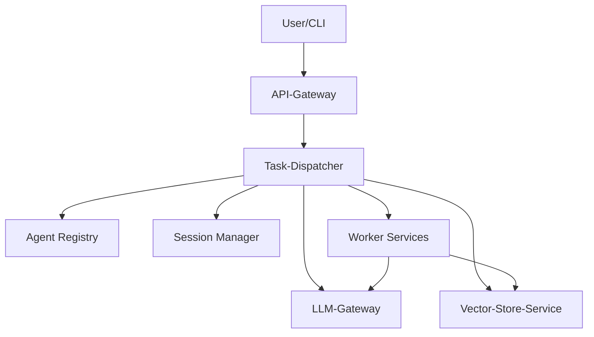

# Agent-NN

Agent-NN evolves into a **Modular Control Plane (MCP)**. The system is split into dedicated microservices that cooperate to solve user requests with the help of large language models and domain specific agents.

## Systemarchitektur



- **Task-Dispatcher** – zentrale Orchestrierung, ersetzt den ehemaligen Supervisor.
- **Agent Registry** – hält verfügbare Agenten und deren Fähigkeiten bereit.
- **Session Manager** – speichert Gesprächskontexte (Redis).
- **Vector-Store-Service** – stellt Wissens- und Dokumentensuche bereit.
- **LLM-Gateway** – einheitliche Schnittstelle zu OpenAI oder lokalen Modellen.
- **Worker Services** – eigenständige Agenten (Dev, OpenHands, LOH ...).
- **API-Gateway** – optionaler Einstiegspunkt für CLI oder Web-UI.

## Getting Started

1. Clone the repository and install the Python requirements.
2. Start the basic services via Docker Compose:

```bash
docker-compose up dispatcher registry session-manager
```

3. Send a test request to the dispatcher:

```bash
curl -X POST http://localhost:8000/task -d '{"task": "hello"}'
```

This minimal setup uses mock services. In later phases the Vector-Store and LLM-Gateway are added and worker services run as separate containers.

## Projektstatus

Die Modernisierung erfolgt in mehreren Phasen (siehe `ROADMAP.md`). Der bisherige Monolith wird Schritt für Schritt durch die oben beschriebenen Services ersetzt.
