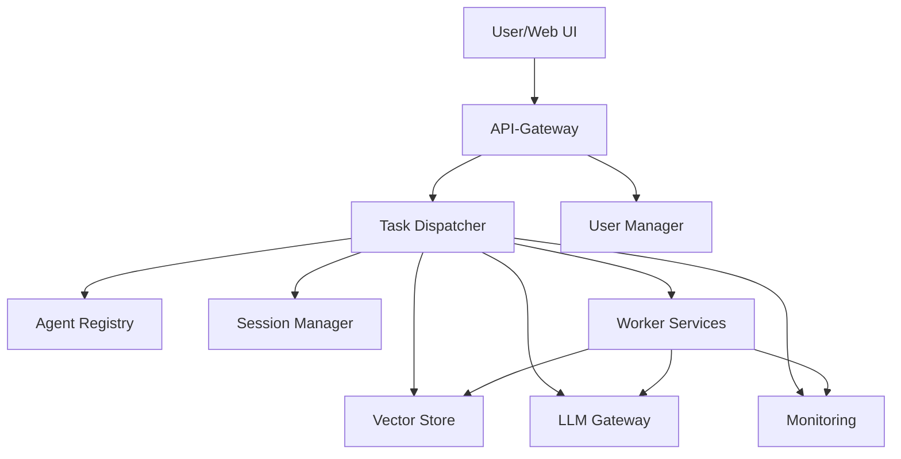

# Agent-NN 


Agent-NN ist ein Multi-Agent-System mit integrierten neuronalen Netzen. Jeder Service erfüllt eine klar definierte Aufgabe und kommuniziert über REST-Schnittstellen. Neben den Backend-Diensten stellt das Projekt ein Python‑SDK, eine CLI und ein React-basiertes Frontend bereit.

📄 [Dokumentation](https://ecospheretwork.github.io/Agent-NN/)
**Aktuelle Version:** v1.0.3 – Robuste Setup-Skripte und verbesserte Docker-Kompatibilität

## 🚀 Quick Start

```bash
# Klonen und Setup in einem Schritt
git clone https://github.com/EcoSphereNetwork/Agent-NN.git
cd Agent-NN
./scripts/setup.sh
```

Das war's! Das Setup-Skript erkennt automatisch Ihr System und installiert alle Abhängigkeiten.

## 📋 Systemvoraussetzungen

### Erforderlich
- **Python 3.9+** mit Poetry
- **Node.js 18+** mit npm
- **Docker** mit Docker Compose (Plugin oder Classic)
- **Git**

### Empfohlen
- **4+ GB RAM** (8 GB für größere Modelle)
- **2+ CPU Cores**
- **5+ GB freier Speicherplatz**

### Plattformkompatibilität
✅ Ubuntu 20.04+  
✅ macOS 11+  
✅ Windows 10+ (WSL2)  
✅ Debian 11+  
✅ CentOS/RHEL 8+  

### Docker Compose Unterstützung
Das Setup-System erkennt automatisch:
- **Docker Compose Plugin** (`docker compose`) - Moderne Variante
- **Docker Compose Classic** (`docker-compose`) - Legacy-Variante

## 🏗️ Installation

### Automatisches Setup (Empfohlen)
```bash
# Vollständiges Setup mit allen Prüfungen
./scripts/setup.sh

# Setup-Optionen
./scripts/setup.sh --help              # Hilfe anzeigen
./scripts/setup.sh --check-only        # Nur Umgebung prüfen
./scripts/setup.sh --no-docker         # Ohne Docker-Start
./scripts/setup.sh --verbose           # Ausführliche Ausgabe
./scripts/setup.sh --clean             # Entwicklungsumgebung zurücksetzen
```

### Manuelles Setup
```bash
# 1. Repository klonen
git clone https://github.com/EcoSphereNetwork/Agent-NN.git
cd Agent-NN

# 2. Umgebung vorbereiten
cp .env.example .env  # Konfiguration anpassen!

# 3. Python-Abhängigkeiten
poetry install

# 4. Frontend bauen
cd frontend/agent-ui
npm install && npm run build
cd ../..

# 5. Services starten
docker compose up --build -d
```

## Optionale Komponenten (z. B. für ML)

```bash
poetry install --with heavy
```

Alternativ:

```bash
./scripts/setup.sh --install-heavy
```

Um Tests auszuführen:

```bash
pytest -m "not heavy"
```

### Troubleshooting häufiger Probleme

#### Docker Compose Fehler
```bash
# Plugin vs. Classic erkennen
docker compose version    # Plugin (empfohlen)
docker-compose version    # Classic

# Bei Problemen mit Classic:
pip install docker-compose

# Bei Problemen mit Plugin:
# Folge der Docker-Dokumentation für dein System
```

#### Port-Konflikte
```bash
# Prüfe belegte Ports
./scripts/setup.sh --check-only

# Alternative: Ports in docker-compose.yml ändern
nano docker-compose.yml
```

#### Abhängigkeits-Probleme
```bash
# Ubuntu/Debian
sudo apt update && sudo apt install python3 python3-pip nodejs npm docker.io docker-compose-plugin git

# macOS
brew install python node docker git

# Windows (PowerShell als Administrator)
# Installiere Docker Desktop, Python, Node.js manuell
```

## 🔧 Konfiguration

### Umgebungsvariablen (.env)
```bash
# API-Schlüssel
OPENAI_API_KEY=your_openai_api_key_here

# Datenbank
DATABASE_URL=postgresql://postgres:postgres@db:5432/agent_nn

# LLM-Konfiguration
LLM_BACKEND=openai          # openai|lmstudio|local
LLM_MODEL=gpt-3.5-turbo
LLM_TEMPERATURE=0.7

# Sicherheit
AUTH_ENABLED=false          # In Produktion: true
JWT_SECRET=your_jwt_secret_here

# Docker-Ports (bei Konflikten anpassen)
API_PORT=8000
FRONTEND_PORT=3000
DB_PORT=5432
REDIS_PORT=6379
```

Vollständige Konfigurationsreferenz: [docs/config_reference.md](docs/config_reference.md)

## 🐳 Docker-Deployment

### Entwicklung
```bash
# Standard-Setup
docker compose up --build -d

# Mit spezifischer Compose-Datei
docker compose -f docker-compose.yml up --build -d

# Services stoppen
docker compose down

# Volumes und Daten zurücksetzen
./scripts/setup.sh --clean
```

### Produktion
```bash
# Produktions-Setup
cp .env.production .env
docker compose -f docker-compose.production.yml up -d

# Monitoring einrichten
docker compose -f docker-compose.monitoring.yml up -d
```

### Kubernetes (Helm)
```bash
# Namespace erstellen und Chart installieren
helm install agent-nn deploy/k8s/helm/agent-nn \
  -n agent-nn --create-namespace \
  --set gateway.apiKey="your-secure-key"
```

## 💻 CLI und SDK

### CLI installieren und verwenden
```bash
# Nach Poetry-Installation verfügbar
poetry run agentnn --help

# Häufige Befehle
poetry run agentnn agents              # Verfügbare Agents
poetry run agentnn sessions            # Aktive Sessions
poetry run agentnn config check        # Konfiguration prüfen
```

### Python-SDK
```python
from sdk.client import AgentNNClient

client = AgentNNClient(base_url="http://localhost:8000")
response = client.send_task("chat", {"input": "Hallo Agent-NN!"})
print(response)
```

## 📊 Überwachung und Logs

### Services überwachen
```bash
# Service-Status prüfen
docker compose ps

# Logs anzeigen
docker compose logs -f api_gateway     # Specific service
docker compose logs -f                 # All services

# Prometheus-Metriken
open http://localhost:9090
```

### Log-Dateien
- **Setup-Logs:** `logs/setup.log`
- **Service-Logs:** `logs/` (Docker-Volumes)
- **Frontend-Logs:** Browser-Konsole

## 🧪 Tests ausführen

```bash
# Vollständige Test-Suite
poetry run pytest

# Mit Coverage
poetry run pytest --cov=agentnn

# Nur bestimmte Tests
poetry run pytest tests/test_setup.py

# Linting und Code-Quality
poetry run ruff check .
poetry run mypy mcp
```

## 🔍 Fehlerdiagnose

### Allgemeine Probleme

1. **Setup schlägt fehl:**
   ```bash
   ./scripts/setup.sh --verbose  # Detaillierte Ausgabe
   ./scripts/setup.sh --check-only  # Nur Prüfungen
   ```

2. **Docker-Services starten nicht:**
   ```bash
   docker compose logs            # Fehler-Logs anzeigen
   docker system prune            # Docker-Cache leeren
   ```

3. **Frontend nicht erreichbar:**
   ```bash
   cd frontend/agent-ui
   npm run build                  # Manuell bauen
   ```

4. **Port-Konflikte:**
   ```bash
   lsof -i :8000                  # Prüfen wer Port nutzt
   # Oder Ports in docker-compose.yml ändern
   ```

### Debug-Modus
```bash
export DEBUG=1
./scripts/setup.sh --verbose
```

## 🤝 Entwicklung und Beiträge

### Entwicklungsumgebung
```bash
# Development-Setup
poetry install
poetry shell

# Pre-commit hooks
pre-commit install

# Tests vor Commit
poetry run pytest
poetry run ruff check .
poetry run mypy mcp
```

### Code-Style
- **Python:** Ruff + MyPy
- **JavaScript/TypeScript:** ESLint + Prettier
- **Shell:** ShellCheck

Siehe [CONTRIBUTING.md](CONTRIBUTING.md) für Details.

## 📚 Dokumentation

- **[Konfiguration](docs/config_reference.md)** - Vollständige Konfigurationsreferenz
- **[Deployment](docs/deployment.md)** - Produktions-Deployment
- **[API-Dokumentation](docs/api/)** - REST-API-Referenz
- **[Integrationen](docs/integrations/)** - n8n, Flowise, etc.
- **[Troubleshooting](docs/troubleshooting.md)** - Häufige Probleme lösen

## 🚧 Roadmap

- [ ] **v1.1:** Verbessertes Monitoring & Alerting
- [ ] **v1.2:** Erweiterte LLM-Provider-Unterstützung
- [ ] **v1.3:** Auto-Scaling für Docker/K8s
- [ ] **v2.0:** Graph-basierte Agent-Workflows

Siehe [ROADMAP.md](ROADMAP.md) für Details.

## 📄 Lizenz

MIT License - siehe [LICENSE](LICENSE) für Details.

## 🆘 Support

- **GitHub Issues:** [Neue Issue erstellen](https://github.com/EcoSphereNetwork/Agent-NN/issues)
- **Diskussionen:** [GitHub Discussions](https://github.com/EcoSphereNetwork/Agent-NN/discussions)
- **Dokumentation:** [docs/](docs/)

---

**Agent-NN:** Robuste Multi-Agent-KI für moderne Anwendungen 🤖✨

---
---

# OLD README:
---

# Agent-NN 


Agent-NN ist ein Multi-Agent-System mit integrierten neuronalen Netzen. Jeder Service erfüllt eine klar definierte Aufgabe und kommuniziert über REST-Schnittstellen. Neben den Backend-Diensten stellt das Projekt ein Python‑SDK, eine CLI und ein React-basiertes Frontend bereit. Weitere Dokumentation befindet sich im Ordner [docs/](docs/).

Aktuelle Version: **v1.0.3** – Flowise-Export und Dokumentation aktualisiert.

## Quick Start

```bash
# Voraussetzung: Docker, Node.js, Python 3.10+, Poetry
git clone https://github.com/EcoSphereNetwork/Agent-NN.git
cd Agent-NN
./scripts/setup.sh
```

## Systemvoraussetzungen

- Python 3.10 oder neuer
- Node.js 18+
- Docker mit Docker Compose (Plugin oder Classic)
- Poetry 1.5+
- Mindestens 4 GB RAM

## Komponentenübersicht



- **Task-Dispatcher** – Koordiniert eingehende Aufgaben.
- **Agent Registry** – Hält verfügbare Worker-Services vor.
- **Session Manager** – Speichert Kontexte in Redis.
- **Vector Store** – Bietet Dokumentensuche für RAG.
- **LLM Gateway** – Einheitliche Schnittstelle zu Sprachmodellen.
- **User Manager** – Verwaltet Nutzerkonten und Tokens.
- **Monitoring** – Prometheus sammelt Metriken aller Dienste.
- **Worker Services** – Domänenspezifische Agenten.

## Schnellstart

1. Repository klonen
   ```bash
   git clone https://github.com/EcoSphereNetwork/Agent-NN.git
   cd Agent-NN
   ```
2. One-Line-Setup ausführen
   ```bash
   ./scripts/setup.sh
   ```
3. Erste Anfrage stellen oder UI öffnen
   ```bash
   curl -X POST http://localhost:8000/task -H "Content-Type: application/json" \
     -d '{"task_type": "chat", "input": "Hallo"}'
   # UI: http://localhost:3000
   ```

Alternativ lassen sich alle Dienste per Docker Compose starten. Das Setup erkennt automatisch,
ob `docker compose` (Plugin) oder `docker-compose` (Classic) verfügbar ist:
```bash
docker compose up --build  # oder docker-compose up --build
```

Zur Fehlersuche helfen `docker ps`, `npm run build` im Frontend-Verzeichnis sowie `poetry shell` für eine interaktive Python-Umgebung. Das Setup wurde unter Ubuntu, macOS und Windows/WSL getestet.

## Hilfreiche Skripte

| Script | Zweck |
|---|---|
| `scripts/deploy/build_frontend.sh` | Baut die React-Oberfläche in `frontend/dist/` |
| `scripts/deploy/start_services.sh` | Startet alle Container nach einem Port- und .env-Check |
| `scripts/deploy/dev_reset.sh` | Entfernt Volumes und lokale Daten für einen Neustart |
| `scripts/setup_local_models.py` | Lädt optionale Llamafile-Modelle herunter |
| `scripts/build_and_test.sh` | Erstellt ein Docker-Image und führt Tests aus |
| `scripts/deploy_to_registry.sh` | Publiziert Images in ein Container-Registry |
| `scripts/start_mcp.sh` | Startet das Microservice-Compose-Setup |
| `scripts/setup.sh` | Komplettes Setup in einem Schritt |

## Poetry-Workflow

Das Projekt nutzt [Poetry](https://python-poetry.org/) zur Verwaltung der Python-Abhängigkeiten.
Nach dem Klonen installierst du alle Pakete und aktivierst die virtuelle Umgebung mit:

```bash
poetry install
poetry shell
```

Alternativ kannst du Befehle auch direkt über `poetry run <command>` ausführen.

## Konfiguration

Eine Beispielkonfiguration steht in `.env.example`. Kopiere die Datei bei Bedarf nach `.env` und passe die Werte an. Eine vollständige Liste aller Variablen ist in [docs/config_reference.md](docs/config_reference.md) beschrieben.

Weitere Details zur Einrichtung findest du in [docs/deployment.md](docs/deployment.md).
## CLI

Das Kommando `agentnn` wird nach der Installation verfügbar. Die Version kann mit

```bash
agentnn --version
```
abgerufen werden.

Wichtige Befehle:
```bash
agentnn agents     # verfügbare Agents auflisten
agentnn sessions   # aktive Sessions anzeigen
agentnn feedback   # Feedback-Tools
agentnn config check  # geladene Konfiguration anzeigen
```

## \ud83d\udd0d Anforderungen & Debugging

Dieses Projekt ben\u00f6tigt Python 3.10, Docker, Node.js und Poetry. Installiere die Abh\u00e4ngigkeiten mit:

```bash
poetry install
# Falls Fehler auftreten:
poetry add torch typer fastapi transformers mlflow
```

F\u00fcr GPU-Nutzung installiere torch mit CUDA-Support: [https://pytorch.org/get-started/locally/](https://pytorch.org/get-started/locally/)

Weitere Details findest du im Ordner [docs/](docs/).

### Example `llm_config.yaml`

```yaml
default_provider: openai
providers:
  openai:
    type: openai
    api_key: ${OPENAI_API_KEY}
  anthropic:
    type: anthropic
    api_key: ${ANTHROPIC_API_KEY}
  local:
    type: local
    model_path: ./models/mistral-7b.Q4_K_M.gguf
```

## 🤖 Installation (Entwicklung)

```bash
# 1. Abhängigkeiten sicherstellen
sudo apt install docker docker-compose nodejs npm python3-poetry

# 2. Repository klonen
git clone https://github.com/EcoSphereNetwork/Agent-NN.git && cd Agent-NN

# 3. Setup starten
./scripts/setup.sh
```

### Empfohlene Umgebung

- Python 3.9 oder neuer
- Mindestens 4 GB RAM (8 GB empfohlen)

## Frontend Development

The consolidated React interface lives in `frontend/agent-ui`. All legacy
components have been archived under `archive/ui_legacy`.

```bash
cd frontend/agent-ui
npm install
npm run dev
```

Run `npm run build` to create the static files in `frontend/dist/`.

## Integrations

Agent-NN stellt Plugins für n8n und FlowiseAI bereit. Details finden sich in
[docs/integrations](docs/integrations/index.md). Schnelleinstiege stehen in den Abschnitten [n8n Quick Start](docs/integrations/n8n.md#quick-start) und [Flowise Quick Start](docs/integrations/flowise.md#quick-start).
Die Beispielkomponenten lassen sich mit `npm install && npx tsc` in den jeweiligen Unterordnern kompilieren und anschließend
in n8n bzw. Flowise registrieren. Der PluginManager lädt nur die JavaScript-Dateien,
daher müssen die Komponenten vor einer Veröffentlichung stets gebaut werden. Der vollständige Ablauf ist im
[Full Integration Plan](docs/integrations/full_integration_plan.md) beschrieben.
Sämtliche Integrationen akzeptieren optionale Parameter wie `path`, `method`,
`headers`, `timeout` sowie Auth-Daten, um alternative Endpunkte zu adressieren.


### Quickstart Flowise

```bash
cd integrations/flowise-agentnn
npm install && npx tsc
# In der Flowise-UI die Datei dist/AgentNN.js hochladen
```

Danach kann ein Flow den Agent über das Feld `endpoint` ansprechen. Beispiel-
Flows liegen im gleichen Ordner.

Jeder neu erstellte Agent wird zusätzlich im Flowise-Format abgelegt. Die Datei
`<name>_flowise.json` kann über `GET /agents/<id>?format=flowise` abgerufen und
direkt in Flowise importiert werden.

```bash
curl http://localhost:8000/agents/demo?format=flowise
```

## MCP Server

Der integrierte MCP-Server stellt unter `/v1/mcp/*` eine kompatible Schnittstelle für externe Dienste bereit. Die Python-Klasse `agentnn.mcp.MCPClient` ermöglicht das Senden von Aufgaben und Kontextdaten. Weitere Informationen finden sich in [docs/mcp.md](docs/mcp.md).


## Tests & Beiträge

Bevor du einen Pull Request erstellst, führe bitte `ruff`, `mypy` und `pytest` aus. Details zum Entwicklungsprozess findest du in [CONTRIBUTING.md](CONTRIBUTING.md) sowie im Dokument [docs/test_strategy.md](docs/test_strategy.md). Sollten Module fehlen, können lokale Wheels oder ein internes Paketmirror verwendet werden.
Manche Tests benötigen zusätzliche GPU-Bibliotheken wie `torch`. Wenn diese nicht installiert werden können, lasse die Schwerlast-Tests aus:

```bash
pytest -m "not heavy"
```

Das Setup-Skript bietet dafür die Option `--install-heavy`, um `torch` über das CPU-Wheel zu installieren.

## Releases

Der komplette Ablauf für neue Versionen ist im [Release Checklist](docs/release_checklist.md) beschrieben.

## Monitoring & Maintenance

Prometheus scrapes metrics from each service at `/metrics`. A sample configuration
is provided in `monitoring/prometheus.yml`. Logs are persisted under `/data/logs/`
and can be mounted as a volume in production. See `docs/maintenance.md` for
backup and update recommendations.

## 🔭 Zukunft & Weiterentwicklung

Die aktuelle Version bildet einen stabilen Grundstock für Agent-NN.
Eine kompakte Übersicht befindet sich in
[docs/roadmap.md](docs/roadmap.md). Die detaillierte Aufgabenliste steht in
[ROADMAP.md](ROADMAP.md).

## Offene Punkte

Einige Tests schlagen aktuell wegen fehlender Abhängigkeiten fehl (`mypy` und `pytest`).
Installiere vor dem Ausführen der Checks notwendige Pakete wie `pydantic`, `fastapi` und `requests`. Bei eingeschränktem Netzwerkzugriff empfiehlt es sich, die Räder vorab zu cachen oder eine interne Paketmirror zu verwenden.
