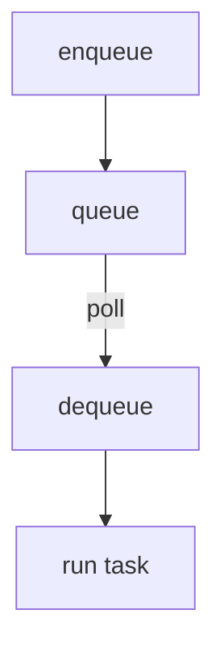

# Dispatch Queue

The dispatcher keeps tasks in an in-memory queue. Each `ModelContext` contains
`priority`, `deadline` and the timestamp `submitted_at` which allows
ordering tasks. The queue sorts by the earliest deadline, then by priority
(lowest number means higher priority) and finally by the task value. Tasks
whose deadline is in the past are marked as `expired` when `expire_old_tasks`
gets called.

