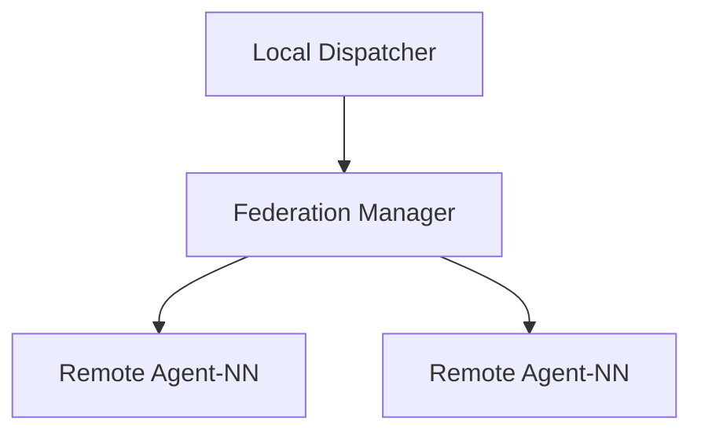

# Federation Manager

The Federation Manager coordinates tasks across multiple Agent-NN clusters. Nodes
can be registered via the API and tasks are forwarded to the selected cluster.

Use `/nodes` to register a remote instance and `/dispatch/{name}` to send tasks.
