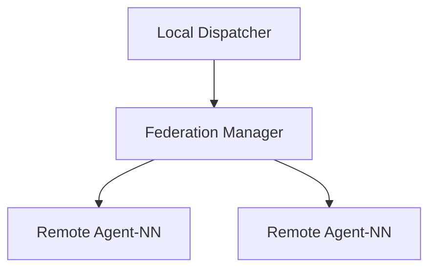

# Federation Manager

The Federation Manager coordinates tasks across multiple Agent-NN clusters. Nodes
can be registered via the API and tasks are forwarded to the selected cluster.



Use `/nodes` to register a remote instance and `/dispatch/{name}` to send tasks.
The service keeps a heartbeat timestamp for each node and removes entries after
60 seconds without contact. A round-robin dispatcher chooses the next available
node while considering the number of active tasks.

```
sequenceDiagram
    participant FM as Federation Manager
    participant N1 as Node A
    participant N2 as Node B
    FM->>N1: POST /nodes/{name}/heartbeat
    FM->>N2: POST /nodes/{name}/heartbeat
    loop task
        FM->>N1: POST /dispatch/auto
        FM->>N2: POST /dispatch/auto
    end
```

