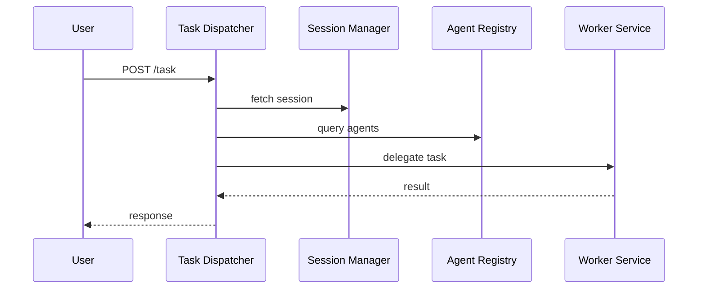

# MCP Data Flow

1. A user sends a request via CLI or Web UI to the **API Gateway**.
2. The gateway forwards the task to the **Task-Dispatcher**.
3. The dispatcher checks the **Session Manager** for context and queries the **Agent Registry** for suitable workers.
4. If additional knowledge is required, the dispatcher or worker queries the **Vector Store Service**.
5. Worker services use the **LLM Gateway** to generate answers or code.
6. Results are returned to the dispatcher and from there to the user.

This flow decouples responsibilities and allows each service to evolve independently.

