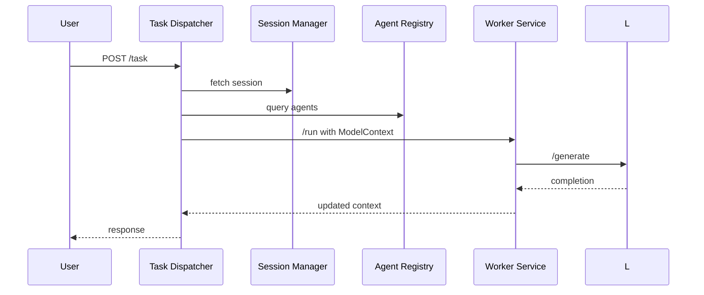

# MCP Data Flow

1. A user sends a request via CLI or Web UI to the **API Gateway**.
2. The gateway forwards the task to the **Task-Dispatcher**.
3. The dispatcher checks the **Session Manager** for context and queries the **Agent Registry** for suitable workers.
4. Anschließend sendet er ein `ModelContext`-Objekt an den gewählten **AgentWorker**.
5. Der Worker ruft das **LLM Gateway** auf (und optional den **Vector Store**), um eine Antwort zu generieren.
6. Der Worker gibt das aktualisierte `ModelContext` an den Dispatcher zurück, der es an den Nutzer weiterleitet.

This flow decouples responsibilities and allows each service to evolve independently.

