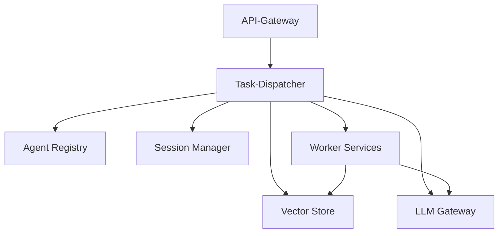
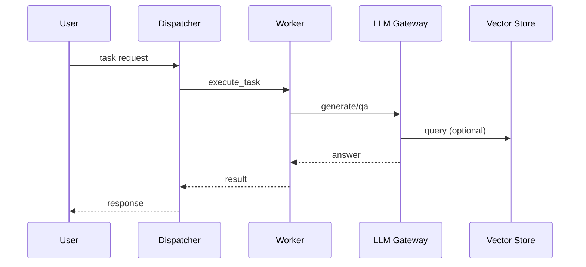

# MCP Overview

The Modular Control Plane architecture breaks Agent-NN into small services that communicate over defined APIs. This overview outlines the main building blocks.



The following sequence shows the end-to-end flow after Phase&nbsp;3:



Each service can be scaled independently and replaced without touching the others. The dispatcher coordinates requests and uses the registry to find suitable workers. Session data and knowledge retrieval are handled by dedicated services.

### Directory Layout

```
mcp/
├── task_dispatcher/
├── agent_registry/
├── session_manager/
├── vector_store/
├── llm_gateway/
├── worker_dev/
├── worker_loh/
└── worker_openhands/
```

All services expose small FastAPI apps with `/health` endpoints and stubs for their main functions.


