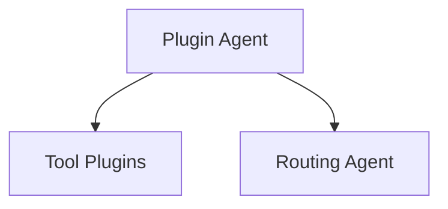

# Plugin Architecture

The plugin system enables dynamic extension of worker agents with new tools.
Each plugin implements a small interface and can be loaded at runtime.

Plugins are discovered from the `plugins/` directory. They register their name
and summary via a `manifest.yaml` file. The `PluginAgentService` exposes an API
that executes a specific tool and returns its result.
