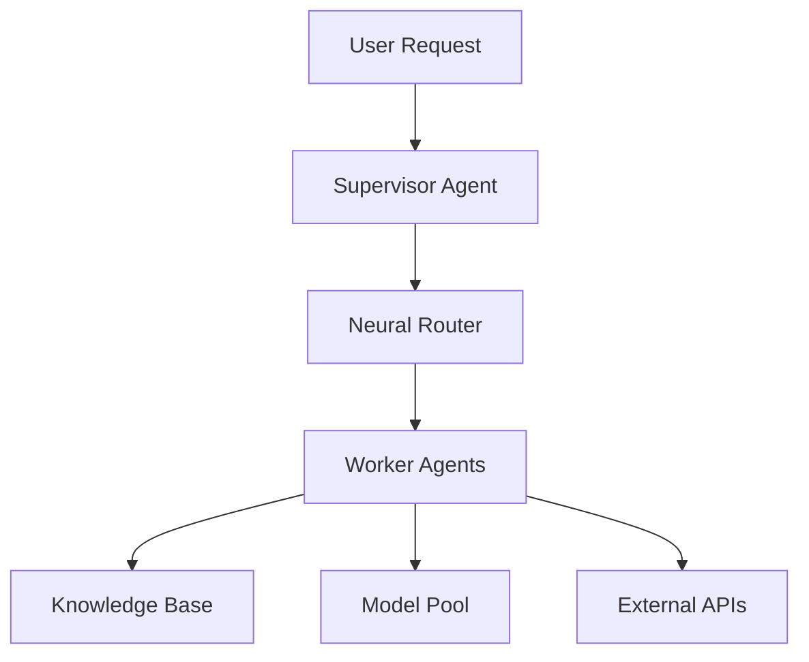
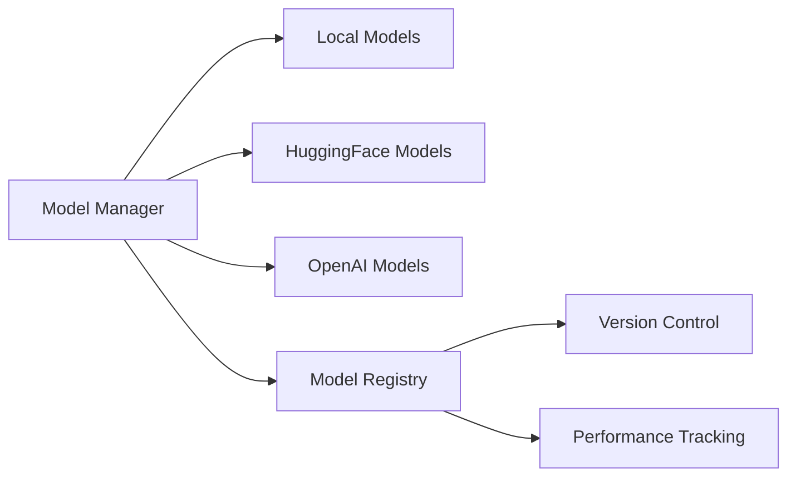
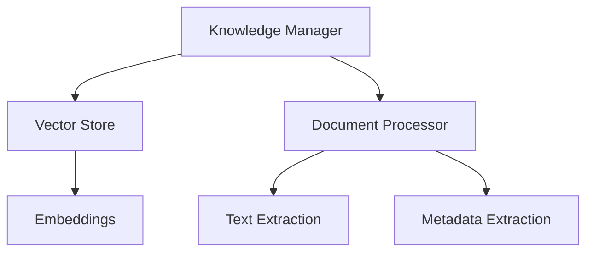
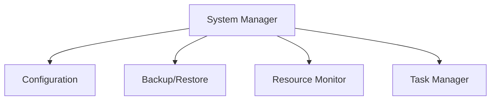
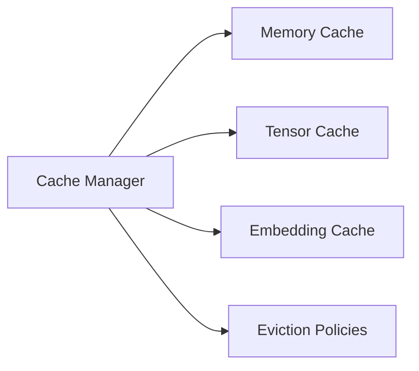
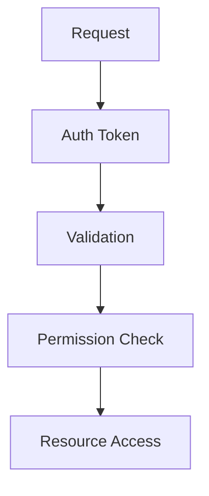

# System Architecture

This document provides a comprehensive overview of the Agent-NN system architecture.

## Overview

Agent-NN is a distributed multi-agent system that combines large language models with neural networks for intelligent task routing and execution. The system is designed to be:

- Scalable: Handles increasing workloads through distributed processing
- Resilient: Maintains operation despite component failures
- Extensible: Easily accommodates new models and capabilities
- Efficient: Optimizes resource usage and response times

## Core Components

### 1. Agent System



Components:
- **Supervisor Agent**: Manages task delegation and coordination
- **Neural Router**: Uses ML for optimal agent selection
- **Worker Agents**: Specialized task executors
- **Knowledge Base**: Domain-specific information store
- **Model Pool**: Collection of available models
- **External APIs**: Integration with external services

### 2. Model Management



Features:
- Model loading and unloading
- Version management
- Performance monitoring
- Resource optimization
- Cache integration

### 3. Knowledge Management



Capabilities:
- Document ingestion
- Vector storage
- Semantic search
- Automatic updates
- Source management

### 4. System Management



Functions:
- System configuration
- Resource monitoring
- Backup management
- Task scheduling
- Error handling

### 5. Cache Management



Features:
- Multi-type caching
- Configurable policies
- TTL support
- Size management
- Performance metrics

## Data Flow

### 1. Task Processing

```sequence
User->API: Submit Task
API->Supervisor: Forward Request
Supervisor->Router: Get Best Agent
Router->Agents: Check Availability
Agents->Router: Return Status
Router->Supervisor: Return Selection
Supervisor->Agent: Assign Task
Agent->Knowledge Base: Get Context
Agent->Model Pool: Get Model
Agent->Supervisor: Return Result
Supervisor->API: Return Response
API->User: Deliver Result
```

### 2. Model Loading

```sequence
Agent->Model Manager: Request Model
Model Manager->Cache: Check Cache
Cache->Model Manager: Cache Miss
Model Manager->Source: Load Model
Source->Model Manager: Return Model
Model Manager->Cache: Store Model
Model Manager->Agent: Return Model
```

### 3. Knowledge Update

```sequence
System->Knowledge Manager: Update Trigger
Knowledge Manager->Sources: Get Updates
Sources->Document Processor: Raw Data
Document Processor->Vector Store: Processed Data
Vector Store->Knowledge Manager: Update Complete
Knowledge Manager->System: Update Status
```

## Security

### Authentication & Authorization



Features:
- Token-based authentication
- Role-based access control
- Resource isolation
- Audit logging

### Data Protection

- Encryption at rest
- Secure communication
- Access control
- Backup encryption

## Monitoring & Metrics

### System Metrics

- CPU usage
- Memory utilization
- Disk usage
- Network traffic
- Cache performance

### Application Metrics

- Response times
- Error rates
- Task completion
- Model performance
- Cache hit rates

### Business Metrics

- Task success rate
- User satisfaction
- Resource efficiency
- Cost per task
- System availability

## Deployment

### Requirements

1. Hardware:
   - CPU: 8+ cores
   - RAM: 16+ GB
   - Storage: 100+ GB
   - GPU: Optional

2. Software:
   - Python 3.9+
   - PyTorch 2.0+
   - Docker
   - Redis

### Configuration

```yaml
system:
  max_concurrent_tasks: 10
  task_timeout: 300
  cache_size: 1024
  log_level: INFO

models:
  default_source: local
  cache_enabled: true
  auto_update: true

knowledge:
  update_interval: 3600
  max_documents: 10000
  embedding_model: text-embedding-ada-002

cache:
  policy: lru
  cleanup_interval: 60
  default_ttl: 3600
```

### Docker Deployment

```dockerfile
FROM python:3.9-slim

WORKDIR /app

# Install dependencies
COPY requirements.txt .
RUN pip install -r requirements.txt

# Copy application
COPY . .

# Run application
CMD ["python", "main.py"]
```

## Development

### Adding New Features

1. Create feature branch
2. Implement changes
3. Add tests
4. Update documentation
5. Create pull request

### Testing

1. Unit tests:
   ```bash
   pytest tests/unit/
   ```

2. Integration tests:
   ```bash
   pytest tests/integration/
   ```

3. Performance tests:
   ```bash
   pytest tests/performance/
   ```

### Monitoring

1. Start monitoring:
   ```bash
   python -m smolit.monitor
   ```

2. View metrics:
   ```bash
   curl http://localhost:8000/metrics
   ```

## Future Enhancements

1. Dynamic Architecture:
   - Auto-scaling components
   - Resource optimization
   - Load balancing

2. Advanced Features:
   - Multi-model inference
   - Cross-domain learning
   - Automated optimization

3. Integration:
   - Additional model sources
   - External services
   - Custom plugins

## Troubleshooting

### Common Issues

1. Memory Issues:
   - Check cache size
   - Monitor model loading
   - Review concurrent tasks

2. Performance Issues:
   - Check resource usage
   - Review cache settings
   - Monitor task queues

3. Network Issues:
   - Check connectivity
   - Verify API access
   - Review timeouts

### Logging

```python
# Log levels
DEBUG: Detailed debugging
INFO: General information
WARNING: Warning messages
ERROR: Error conditions
CRITICAL: Critical failures
```

### Recovery

1. System Backup:
   ```bash
   python -m smolit.backup create
   ```

2. System Restore:
   ```bash
   python -m smolit.backup restore <backup_id>
   ```

3. Cache Clear:
   ```bash
   python -m smolit.cache clear
   ```
