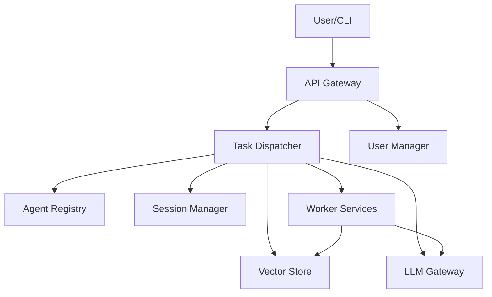

# System Architecture

The MCP version of Agent-NN is composed of several cooperating services. The following diagram illustrates the overall flow.

### Components

- **Task Dispatcher**: central orchestrator that selects the right worker for each task.
- **Agent Registry**: database of all available worker services.
- **Session Manager**: stores ongoing conversation context.
- **Worker Services**: execute domain specific actions.
- **Vector Store**: semantic search across documentation and code.
- **LLM Gateway**: unified access to language models.
- **User Manager**: manages user accounts and tokens.
- **API Gateway**: optional entry point with authentication and routing.

This setup replaces the former SupervisorAgent architecture and enables independent scaling of each service.
