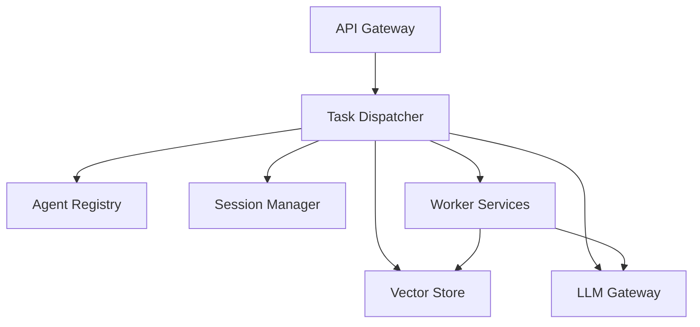

# Architecture Overview

This document provides a short overview of the services composing the Agent-NN Modular Control Plane.

* **Task Dispatcher** – entrypoint for tasks and routing logic.
* **Agent Registry** – stores metadata about available worker agents.
* **Session Manager** – persists conversation contexts and feedback.
* **Vector Store** – manages document embeddings and similarity search.
* **LLM Gateway** – unified API for text generation and embeddings.
* **Worker Services** – domain-specific agents executing subtasks.

All services expose `/health` and `/metrics` endpoints and can be configured via environment variables found in `.env.example`.
