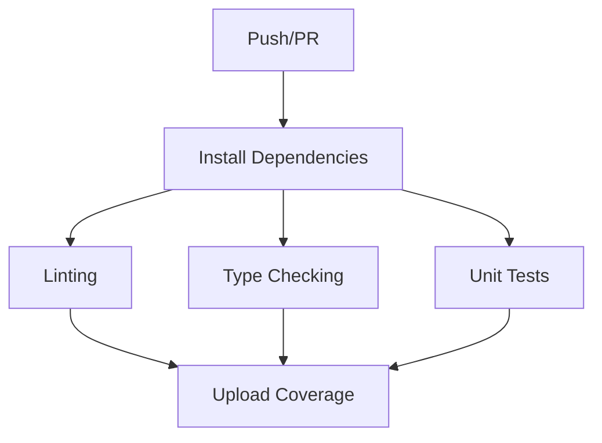
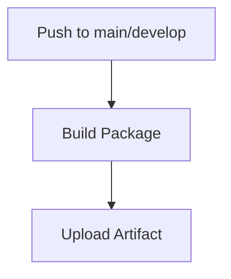
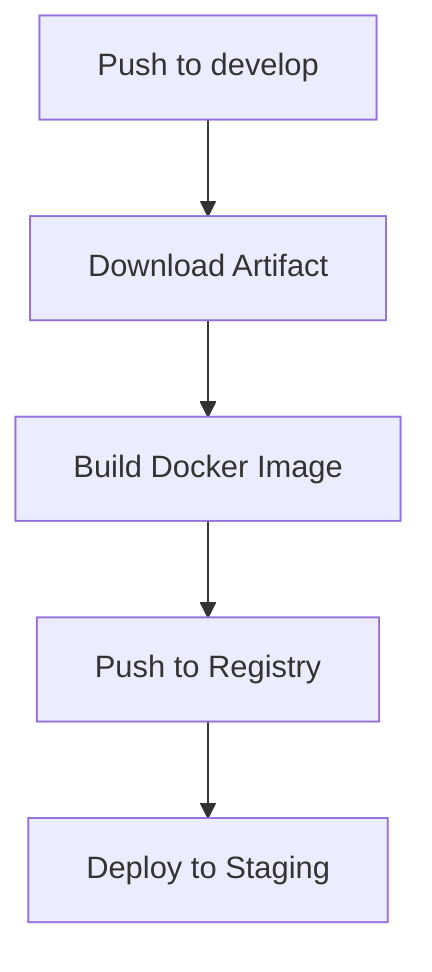
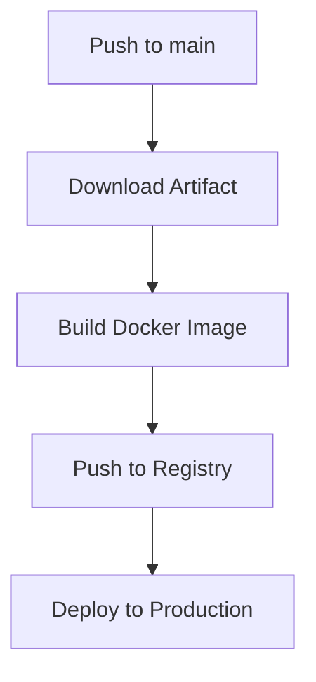

# CI/CD Pipeline

This document describes the Continuous Integration and Continuous Deployment (CI/CD) pipeline for Smolit LLM-NN.

## Overview

Our CI/CD pipeline automates the following processes:

1. Code Quality Checks
2. Testing
3. Building
4. Deployment

## Pipeline Stages

### 1. Test Stage

The test stage runs on every push and pull request:



Components:
- Linting with `flake8`, `black`, and `isort`
- Type checking with `mypy`
- Unit tests with `pytest`
- Coverage reporting with `codecov`

### 2. Build Stage

The build stage runs on pushes to main and develop branches:



Components:
- Package building with Poetry
- Artifact uploading to GitHub Actions

### 3. Deployment Stages

#### Staging Deployment

Runs on pushes to the develop branch:



#### Production Deployment

Runs on pushes to the main branch:



## Configuration

### GitHub Actions

The pipeline is configured in `.github/workflows/ci.yml`:

```yaml
name: CI/CD Pipeline

on:
  push:
    branches: [ main, develop ]
  pull_request:
    branches: [ main, develop ]

jobs:
  test:
    # Test job configuration...
    
  build:
    # Build job configuration...
    
  deploy-staging:
    # Staging deployment configuration...
    
  deploy-production:
    # Production deployment configuration...
```

### Environment Variables

Required secrets in GitHub:

- `DOCKER_USERNAME`: Docker Hub username
- `DOCKER_PASSWORD`: Docker Hub password
- `STAGING_SSH_KEY`: SSH key for staging server
- `PRODUCTION_SSH_KEY`: SSH key for production server

### Docker Configuration

Dockerfile for the application:

```dockerfile
FROM python:3.10-slim

WORKDIR /app

# Install Poetry
RUN pip install poetry

# Copy project files
COPY pyproject.toml poetry.lock ./
COPY smolit_llm_nn/ ./smolit_llm_nn/

# Install dependencies
RUN poetry config virtualenvs.create false \
    && poetry install --no-dev

# Run application
CMD ["poetry", "run", "python", "-m", "smolit_llm_nn"]
```

## Monitoring

The pipeline includes several monitoring points:

1. Test Results:
   - Unit test results
   - Coverage reports
   - Linting issues

2. Build Artifacts:
   - Package versions
   - Build logs
   - Docker image tags

3. Deployment Status:
   - Deployment success/failure
   - Environment health checks
   - Service metrics

## Troubleshooting

Common issues and solutions:

1. Failed Tests:
   - Check test logs in GitHub Actions
   - Run tests locally: `poetry run pytest`
   - Verify dependencies are up to date

2. Build Failures:
   - Check Poetry build logs
   - Verify package dependencies
   - Check Docker build context

3. Deployment Issues:
   - Verify environment variables
   - Check Docker registry access
   - Validate deployment configurations

## Best Practices

1. Branch Protection:
   - Require PR reviews
   - Enforce status checks
   - Protect main and develop branches

2. Version Control:
   - Use semantic versioning
   - Tag releases
   - Keep changelog updated

3. Testing:
   - Write comprehensive tests
   - Maintain high coverage
   - Test in isolation

4. Documentation:
   - Document API changes
   - Update deployment guides
   - Keep README current

## Future Improvements

Planned enhancements to the pipeline:

1. Automated Version Bumping:
   - Implement semantic release
   - Automate changelog generation
   - Version tagging

2. Enhanced Testing:
   - Integration tests
   - Performance tests
   - Security scans

3. Deployment Enhancements:
   - Blue-green deployments
   - Canary releases
   - Automated rollbacks

4. Monitoring Improvements:
   - Enhanced metrics
   - Automated alerts
   - Performance tracking